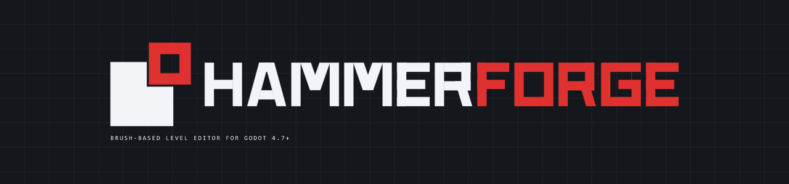
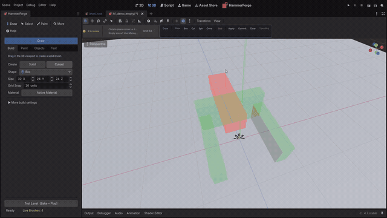

<p align="center">
  <picture>
    <source media="(prefers-color-scheme: dark)" srcset="docs/brand/png/readme-banner.png">
    <source media="(prefers-color-scheme: light)" srcset="docs/brand/png/readme-banner-light.png">
    
  </picture>
</p>

<p align="center">
  <strong>Brush-based level editor for Godot 4.7+</strong><br>
  Requires Godot 4.7+ (tested on 4.7.stable). Works in both editor and exported games via HFIORuntime.<br>
  Draw rooms, carve doors, paint terrain, and bake to optimized meshes — all inside the Godot editor.
</p>

<p align="center">
  <a href="https://github.com/saworbit/hammerforge/actions/workflows/ci.yml"></a>
  
  
  
  
  
</p>

<p align="center">
  
</p>

<p align="center">
  <em>81 brushes. Every column, wall bay and gallery drawn with the tools below,
  textured with the built-in prototype materials.</em>
</p>

<h3 align="center">Carving a doorway</h3>

<p align="center">
  <a href="https://saworbit.github.io/hammerforge/#see-it-in-motion">
    
  </a>
</p>

<p align="center">
  <em>Drag a cut brush through the wall, apply it, then Test Level and walk up to the hole.<br>
  <a href="https://saworbit.github.io/hammerforge/#see-it-in-motion">Watch the full 55-second clip</a>
  or <a href="https://youtu.be/Nilou2q8SjE">on YouTube</a> — it starts from an empty grid and builds the room first.</em>
</p>

> **Fair warning:** This is a solo hobby project in early alpha. I built it to support another project and it grew from there. It's buggy, rough around the edges, and a bit directionless. If any of this looks useful to you, I'd genuinely appreciate help testing and filing issues. Contributions welcome -- just know you're signing up for an adventure, not a polished product.

> **On AI:** Yes, AI assistants helped build this. Writing code, reviewing code I
> wrote myself, drafting docs. Nothing here ships unread or untested, and no image
> models were used for any art, texture or screenshot. The full position, and
> where it is not much help, is in [AI.md](AI.md).

---

## How It Works

Four steps, each a real screenshot of the editor. The dock tab on the left is
the one you would actually be using at that point.

| 1. Draw a floor | 2. Raise the walls |
|---|---|
|  |  |
| Drag a base, click to set height. One brush, one shape. | Add walls and leave a gap for the door. Still two clicks each. |

| 3. Add detail and materials | 4. Test it |
|---|---|
|  |  |
| Platform, ramp, pillars, and prototype textures from the Paint tab. | The Console checks the level, then Test Level bakes and plays it. |

<p align="center">
  
</p>

<p align="center"><em>HammerForge runs inside the Godot editor -- its own dock, main-screen entry, and viewport tools.</em></p>

---

## Why HammerForge?

Level editors like Hammer and TrenchBroom proved that **brush-based workflows** are the fastest way to block out 3D spaces. HammerForge brings that paradigm into Godot so you never have to leave the editor:

- **No full-scene live CSG** -- brushes are lightweight preview nodes; full CSG runs only at bake time. An optional, capped subtract overlay computes only nearby cut previews.
- **Two-click geometry** -- drag a base rectangle, click to set height. Extrude faces to extend rooms. Type exact numbers any time.
- **Free transform** -- rotate and mirror anything you have drawn, in snapped steps about the axis you choose, then array it in a line, a ring, or a lattice.
- **Cut along any plane** -- clip and carve split the real geometry, so a diagonal cut, a rotated brush or a cylinder are all fair game. Clip along a selected face's plane to chamfer a corner in one action.
- **Generate structures** -- hollow any brush into walls (a cylinder becomes a tube), and build an arch, a straight flight of stairs, a spiral staircase or a faceted dome from a handful of numbers, one brush per piece.
- **Go back and change them** -- a structure remembers the numbers that made it. Select a piece, adjust anything, and it rebuilds in place — where you moved it to, keeping the materials you painted on it, and telling you first if a rebuild would overwrite work you did by hand.
- **Paint floors and terrain** -- grid-based floor paint with heightmaps, multi-material blending, auto-connectors (ramps/stairs), and foliage scatter.
- **Bake when ready** -- one click produces merged meshes, collision shapes (trimesh, per-brush convex, or per-visgroup partitioned), lightmap UVs, navmeshes, and LODs.

HammerForge is a single `addons/` folder. No external tools, no custom builds, no export plugins. Drop it in, enable, draw.

---

---

## At a Glance

| | |
|---|---|
| **Subsystem-based coordinator architecture** | **2,860+ unit + integration tests** with CI on every push |
| **15 brush shapes** (box through dodecahedron) | **150 built-in prototype textures** for instant greyboxing |
| **Quake `.map`** + **glTF `.glb`** export | **.hflevel** native format with threaded I/O |
| **Customizable keymaps** (JSON) | **Plugin API** for custom tools |
| **Dark/light theme sync** across all custom UI | **Performance health monitor** with recommendations |
| **HammerForge Console** -- RAG status board, every toggle, live log | **Main-screen entry** -- the mark beside 2D, 3D and Script |

---

---

## Installation

```
1. Copy addons/hammerforge into your project
2. Enable the plugin: Project -> Project Settings -> Plugins -> HammerForge
3. Open a 3D scene and use Create Starter in the empty-state banner
4. Verify: the dock shows Build, Paint, Objects, and Test; the primary toolbar shows Draw, Select, Paint, More, and Help
```

Create Starter adds `LevelRoot`, a floor, sunlight, and a player spawn. Create Empty adds only `LevelRoot`. An intentional Draw-tool left-click can also create an empty root; navigation, selection, and other passive input never modify the scene.

**Upgrading?** See [Install + Upgrade](docs/HammerForge_Install_Upgrade.md) for upgrade steps and cache reset.

### Editor bridges

This repository does not vendor an MCP server or any other editor bridge. If you use one, install it into your own `addons/` folder and keep it out of your commits. `addons/` is an allowlist in `.gitignore`, so a new folder there is ignored until someone adds it deliberately. Enabling a plugin also rewrites the tracked `project.godot`, which is the one change you have to keep out by hand. Tokens, client configuration, and Godot `user://` state are machine-local and must never be committed. See [Contributing](CONTRIBUTING.md).

---

---

## Quick Start


| Step | Action |
|------|--------|
| **1. Create** | In a 3D scene, click **Create Starter**. Choose **Create Empty** only when you do not want the floor, sunlight, and spawn. |
| **2. Draw** | In **Build**, choose Draw + Solid + Box, drag the base in the viewport, then click to set height. |
| **3. Test** | Click **Test Level (Bake + Play)** in **Test**, or press **Ctrl+Enter**. HammerForge checks, bakes, validates the spawn, and runs the scene. |
| **Optional: Cut** | Press **Q** to switch Solid/Cutout, draw through existing geometry, then apply or commit cuts. |
| **Optional: Material** | Open **Paint → Materials**, select faces, and assign a prototype or project material. |
| **Optional: Floor paint** | Press **Shift+P**, choose Paint/Erase/Rect/Line/Bucket/Blend, and paint cells or surfaces. |

---

---

## Documentation

| Document | Description |
|----------|-------------|
| [User Guide](docs/HammerForge_UserGuide.md) | Complete usage documentation |
| [MVP Guide](docs/HammerForge_MVP_GUIDE.md) | Architecture and contributor reference |
| [Install + Upgrade](docs/HammerForge_Install_Upgrade.md) | Setup, upgrade, and cache reset |
| [Design Constraints](docs/HammerForge_Design_Constraints.md) | Explicit tradeoffs and limits |
| [Data Portability](docs/HammerForge_Data_Portability.md) | .hflevel / .map / .glb workflow |
| [Texture + Materials](docs/HammerForge_Texture_Materials.md) | Face materials, UVs, and surface paint |
| [Prototype Textures](docs/HammerForge_Prototype_Textures.md) | Built-in 150 SVG textures |
| [Floor Paint Design](docs/HammerForge_FloorPaint_Greyboxing.md) | Grid paint system design |
| [Editor Smoke Checklist](docs/HammerForge_Editor_Smoke_Checklist.md) | Repeatable live-editor verification flow |
| [Development + Testing](DEVELOPMENT.md) | Local setup, architecture, test checklist |
| [Spec](HammerForge_SPEC.md) | Technical specification |
| [Changelog](CHANGELOG.md) | Version history |
| [Roadmap](ROADMAP.md) | Planned features and priorities |
| [Brand](docs/brand/BRAND.md) | The mark, palette, and asset generators |
| [AI Disclosure](AI.md) | How AI is used here, what checks it, and where it does not help |
| [Contributing](CONTRIBUTING.md) | How to contribute |
| [Code of Conduct](CODE_OF_CONDUCT.md) | Expected behavior and how to report a problem |
| [Security Policy](SECURITY.md) | What counts as a vulnerability and how to report one privately |
| [Demo Clips](docs/demos/README.md) | Clip list and naming scheme |
| [Sample Levels](samples/) | Minimal and stress test scenes |

---

---

## Help Wanted

This is a one-person project and there's more here than one person can properly test. If you try HammerForge and something breaks, **please open an issue** -- even a one-liner like "Hollow crashed on a cylinder" is helpful. Specific areas where help would make a real difference:

- **Bug reports** -- the test suite covers a lot, but editor-context bugs are hard to catch headless
- **Playtesting** -- try the workflows (draw, bake, quick play) and report what feels broken or confusing
- **Edge cases** -- large levels, unusual brush shapes, rapid undo/redo, plugin reload cycles
- **Documentation** -- if something in the user guide doesn't match reality, flag it

### Where to start

- **[Good first issues](https://github.com/saworbit/hammerforge/labels/good%20first%20issue)** — scoped small, no deep architecture knowledge needed
- **[Help wanted](https://github.com/saworbit/hammerforge/labels/help%20wanted)** — things I can't get to alone
- **[Browse by area](https://github.com/saworbit/hammerforge/labels)** — `area:` labels map to the dock tabs: Build, Paint, Objects, Test
- **[Milestones](https://github.com/saworbit/hammerforge/milestones)** — what the open work is grouped under
- **[Discussions](https://github.com/saworbit/hammerforge/discussions)** — for questions that aren't bug reports

See [CONTRIBUTING.md](CONTRIBUTING.md) for local setup and the check commands, and
[CODE_OF_CONDUCT.md](CODE_OF_CONDUCT.md) for how we treat each other here.

---

---

## Every Switch, With a Reason

The Console's **Controls** tab collects every HammerForge setting in one place,
grouped by what it affects — *Viewport* (what you see while building, none of it
changes the level), *Bake* (how drafts become the meshes that ship), and *Safety
net* (autosave, backups, logging). Each switch carries a one-line reason, not
just a label.

<p align="center">
  
</p>

---

## Full Documentation

The complete feature reference, architecture notes, keyboard shortcuts, testing
guide, roadmap and troubleshooting now live in the documentation site:

- **[Features and Reference](docs/features.md)** -- every workflow in detail
- **[User Guide](docs/HammerForge_UserGuide.md)**
- **[Install and Upgrade](docs/HammerForge_Install_Upgrade.md)**
- **[Regenerating the screenshots](docs/demos/README.md)**
