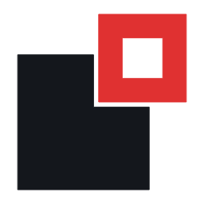

# HammerForge — brand identity

`saworbit/hammerforge` · a brush-based level editor for Godot 4.7+

---

## The mark

<p>
  <picture>
    <source media="(prefers-color-scheme: dark)" srcset="png/mark-dark-256.png">
    
  </picture>
</p>

A filled solid with a corner bitten out, and an outlined square overhanging that
corner.

It is two readings at once, and both are literally true of HammerForge:

| Reading | What it means |
| :--- | :--- |
| **A solid, and the subtract brush that shaped it** | The boolean. The one operation that makes this a brush editor rather than a mesh editor: you place a negative solid, and a doorway appears. |
| **Filled versus outlined** | Draw time versus bake time. An unbaked brush is a lightweight preview node; only at bake does it become merged solid geometry. The mark shows both states of the same object. |

More loosely — and this is the softest of the three — it is also two objects for a
two-part name: the thing that shapes, and the thing shaped.

The cutter **overhangs** the corner rather than sitting inside the notch. Tucked
inside, the eye reads one shape with a window; overhanging, it reads two objects
that met. The **kerf** — a 3-unit gap between the solid's cut edges and the
cutter — is what keeps them separable in a single colour.

The solid carries roughly **2.4×** the cutter's area. It is the thing you made;
the cutter is what shaped it, and it must never dominate.

**Deliberately avoided:**

- **A literal hammer.** The obvious answer, and the wrong one twice over: Valve's
  Hammer is a trademark in this exact category, and a hammer head rasterises to
  an "S" below 32px — tested, not assumed.
- **An anvil.** Generic forge iconography, and it turns to mud at small sizes.
- **The Godot robot head.** A trademark of the Godot Foundation. An addon should
  not wear the engine's mark.
- **A square ring with a gap** (a room in plan, a lit doorway). Both were built
  and both were dropped: NetApp's symbol is an angular arch, and this is the same
  family of form.
- **The greybox checker.** Insider-correct for the audience, but a checkerboard
  is a pattern, not a mark — scattered cells read as noise.

## Weights

| Asset | Use |
| :--- | :--- |
| `hammerforge-mark.svg` | **Master.** Everything ≥ 20px. Kerf 3u, ring 14u on a 100-unit grid. |
| `hammerforge-mark-compact.svg` | ≤ 20px only — kerf 7u, ring 16u, overhang pulled in. |

The kerf is the first feature to die. At 16px the master's 3u kerf rasterises to
**0.46px**: the two solids fuse and the boolean disappears exactly where the mark
is used most. The compact weight holds it at **1.17px**, with the ring at 2.67px
and the counter at 3.00px.

Never use the compact weight above 20px, and never scale the master below 20px.
`icon.svg` and `favicon.svg` both ship the compact weight.

## Colour

The palette is not invented. Red is the colour HammerForge's own viewport already
uses to outline subtract brushes — the mark uses the tool's own language for
exactly the object it draws.

Godot blue is **deliberately absent**. It appears in the repo's badges, but it is
the engine's colour; an addon that wears it reads as first-party, which this is
not.

| Token | Hex | Role |
| :--- | :--- | :--- |
| **Red** | `#E03131` | The subtract brush. The only accent. |
| **Ink** | `#14171C` | The solid, on light grounds. |
| **Paper** | `#F2F4F7` | The solid, on dark grounds. |
| **Slate** | `#79818F` | Annotation and rules. No accent role. |

One file has to serve both editor themes, so the accent had to clear **3:1 on
white and on Godot's `#1D2229`**. That test picked the red and rejected the
alternatives:

| Candidate | On white | On dark | |
| :--- | ---: | ---: | :--- |
| `#E03131` red | 4.51 | 3.54 | **chosen** |
| `#C92A2A` cooler red | 5.46 | 2.93 | fails on dark |
| `#0CA5C0` cyan | 2.93 | 5.45 | fails on white |
| `#4C6B8A` steel | 5.56 | 2.88 | fails on dark |
| `#2F9E44` green | 3.45 | 4.64 | passes — but green is *additive* in the viewport |

Red is never applied to the solid, and the cutter is never a neutral. The accent
marks the subtract brush and nothing else.

The mark must remain fully functional in one colour. Every asset ships a
`currentColor` variant.

## Lockups

The mark is not a letter, so it sits beside the wordmark without stuttering.

- `hammerforge-lockup-two-tone.svg` — **primary.** HAMMER in ink, FORGE in red.
- `hammerforge-lockup-dark-two-tone.svg` — the same, for dark grounds.
- `hammerforge-lockup.svg` — one colour, `currentColor`. READMEs, terminals, print.
- `hammerforge-lockup-stacked.svg` — mark over wordmark, for square and narrow space.
- `hammerforge-wordmark.svg` — name alone, where the mark already appears nearby.

## The wordmark

Custom-drawn on the mark's own grid — rectangles, diagonals, and a single stem
weight. No font is required or referenced; all letterforms are outlined geometry,
so no font licence travels with an MIT asset.

## Clear space & minimum size

- **Clear space:** one cutter width (52 grid units) on all four sides.
- **Minimum size:** mark 16px (compact weight); lockup 180px wide; stacked
  lockup 72px wide.

Do not rotate — the bite is a corner operation, not a floating badge. Do not
stretch; solid and cutter share one module grid. Do not close the kerf.

## Files

```
docs/brand/svg/   20 sources — currentColor where one-colour use applies
docs/brand/png/   92 raster exports, 16 → 1024, plus banners
```

`icon.svg` at the repo root is the Godot project icon (`project.godot` →
`config/icon`). It is written by `build.py` alongside the rest, so it cannot
drift from the brand set — do not hand-edit it.

`png/readme-banner.png` / `-light.png` — 1280×300, top of README.md.
`png/social-preview.png` — 1280×640, GitHub social preview (Settings → Social preview).
`svg/favicon.svg` + `png/favicon-16/32/48.png` — docs site.

**The README references the banners as PNG, not SVG, on purpose.** Their SVG
sources set the tagline in a system font stack, and GitHub's SVG sanitiser does
not render text reliably across platforms. The SVG sources are committed for
editing; the PNGs are what ship.

## Regenerating

Geometry lives in one place. Every asset — mark, wordmark, lockups, icons,
banners — derives from the constants at the top of `build.py`; nothing is
hand-placed.

```bash
cd docs/brand
python build.py                  # 20 SVG sources -> svg/, plus ../../icon.svg
npm install @resvg/resvg-js      # one-time; prebuilt binary, no system deps
node raster.js                   # 92 PNG exports -> png/
```

Both generators run in place from `docs/brand` and reproduce the committed tree
byte-for-byte.

Change `MASTER`, `COMPACT`, or the palette constants and the whole system
re-derives consistently.

## Licence

MIT, same as the repository. The mark is original work and deliberately shares no
geometry with the Godot Engine logo, which is a trademark of the Godot
Foundation, or with Valve's Hammer.
