# HammerForge

**Brush-based level editor for Godot 4.7+**

Draw rooms, carve doors, paint terrain, and bake to optimized meshes — all
inside the Godot editor.

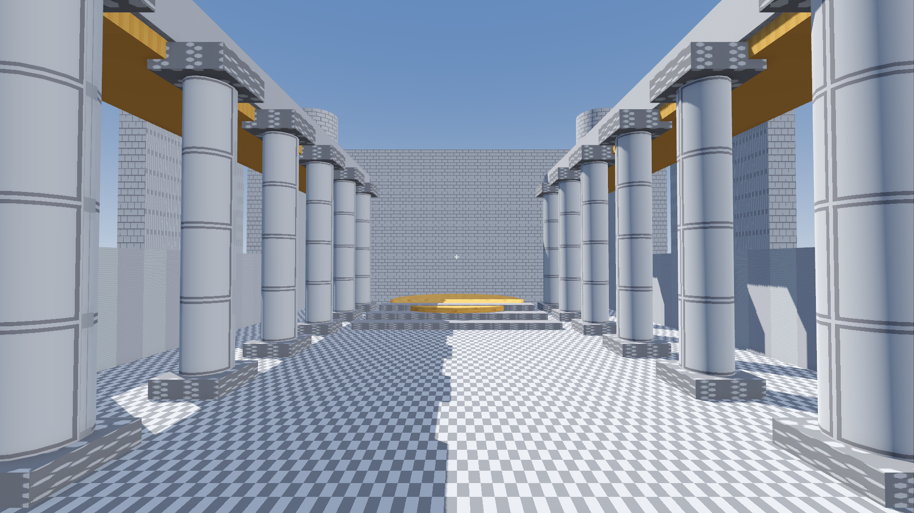

HammerForge is a single `addons/` folder. No external tools, no custom builds,
no export plugins. Drop it in, enable, draw.

!!! warning "Early alpha"
    This is a solo hobby project. It's buggy and rough around the edges.
    Testing and issue reports are genuinely welcome.

## How it works

| Step | | |
|---|---|---|
| **1. Draw a floor** | Drag a base, click to set height. | 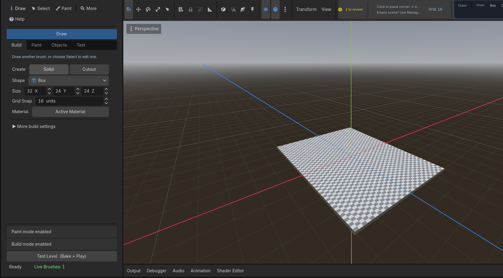 |
| **2. Raise the walls** | Add walls, leave a gap for the door. | 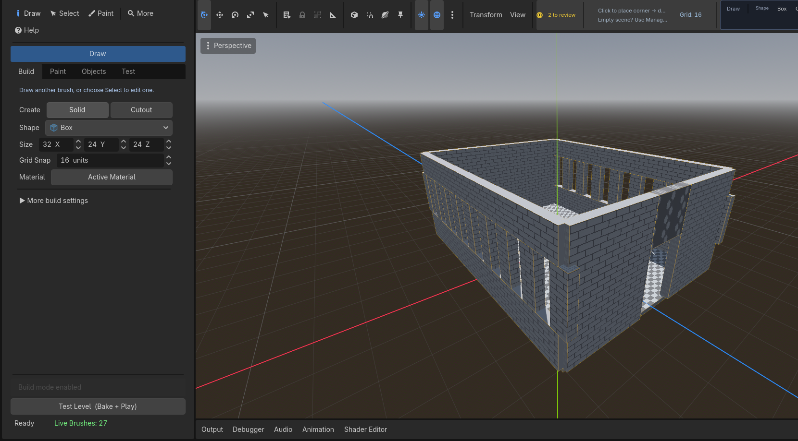 |
| **3. Detail and materials** | Platform, ramp, pillars, prototype textures. | 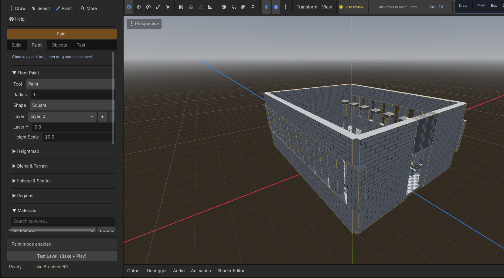 |
| **4. Test it** | The Console checks, then bakes and plays. | 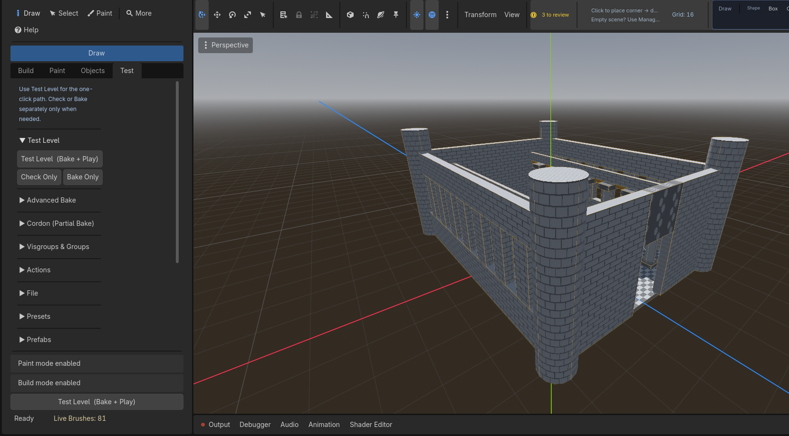 |

## Inside the editor

HammerForge has its own dock, main-screen entry, and viewport tools.

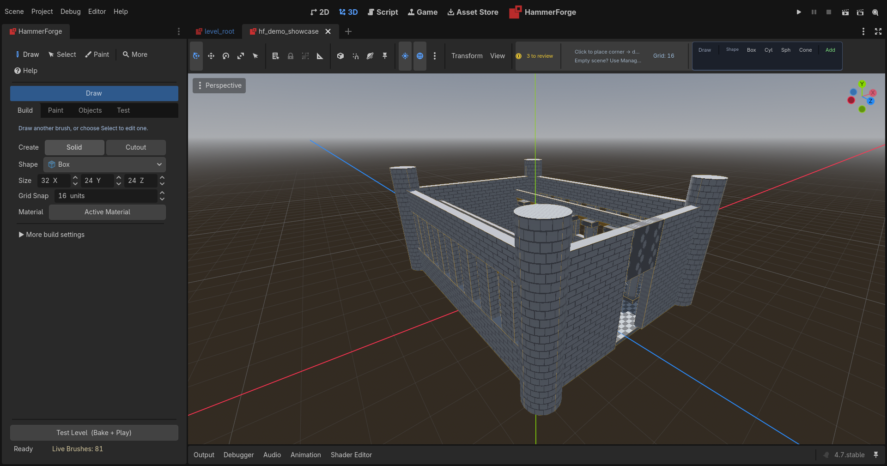

The dock changes mode with the task — Build, Paint, Objects, and Test each
swap the controls and the viewport hint.

=== "Build"
    

=== "Paint"
    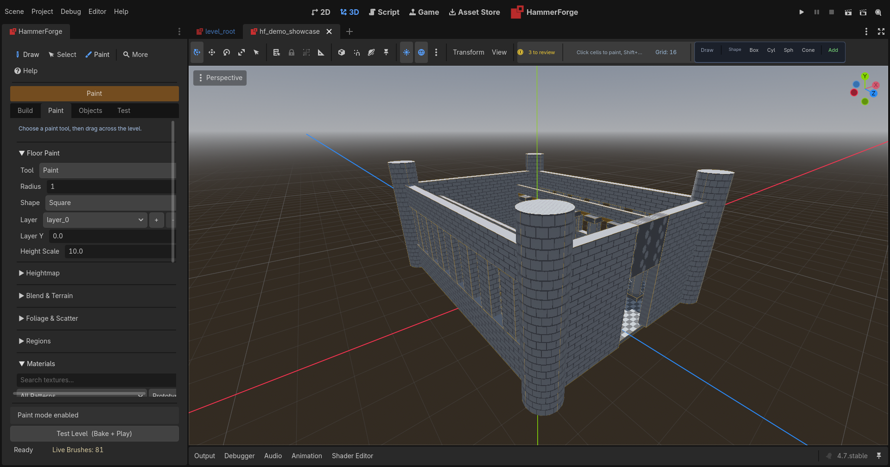

=== "Objects"
    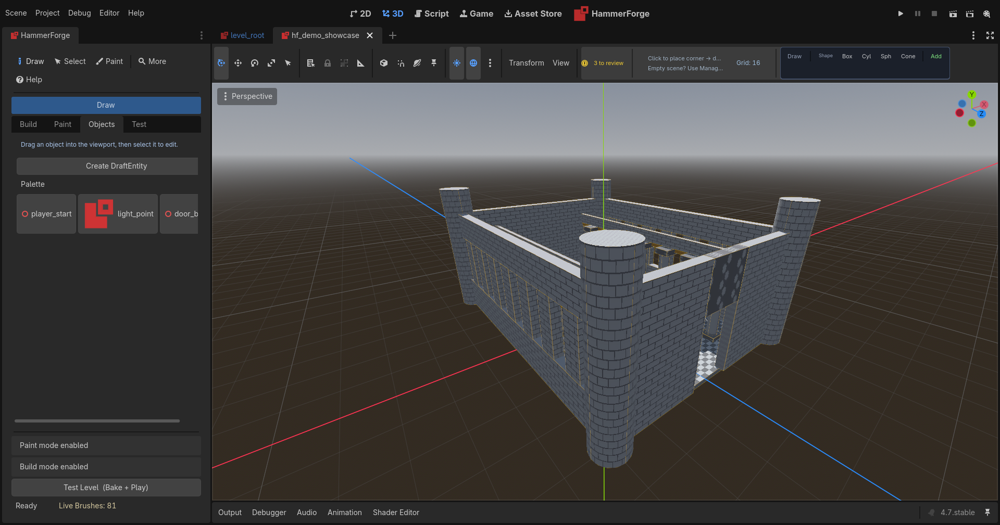

=== "Test"
    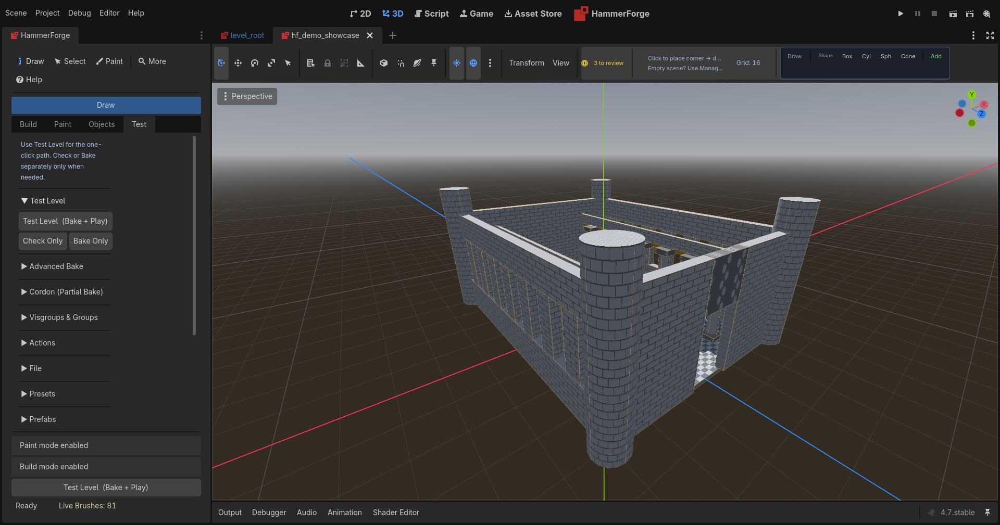

## The Console

A status board for the level: geometry budget, bake state, material palette,
spawn points, autosave and session log.

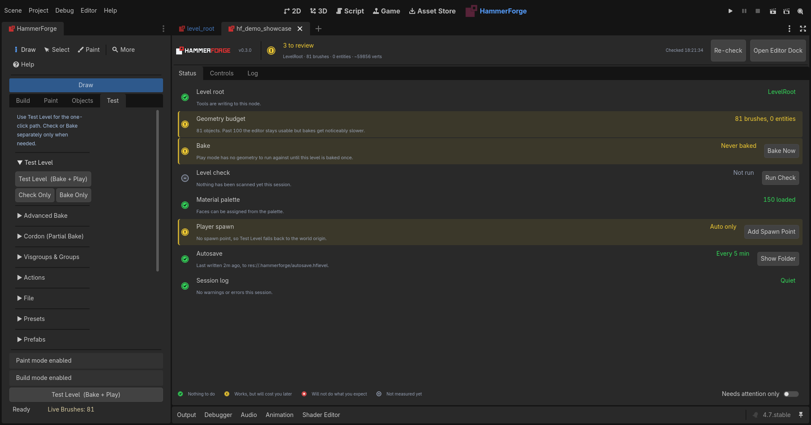

## Everything is configurable, and every switch says why

The Console's **Controls** tab is the whole settings surface in one place —
grouped by what a setting actually affects, with a one-line reason under each
switch rather than a bare label. There is a search box, and descriptions can be
turned off once you know your way around.

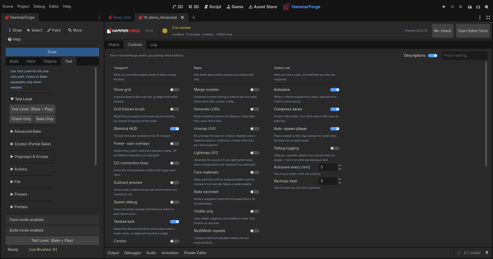

Three groups, because there are only three questions worth separating:

- **Viewport** — *what you see while building. None of these change the level.*
  Grid and snapping, the shortcut HUD, subtract preview, texture lock, cordon.
  Safe to change mid-build; nothing here touches what ships.
- **Bake** — *how drafts become the meshes and collision that ship.* Mesh
  merging, LODs, UV unwrapping, lightmap UV2, navmesh, MultiMesh instancing.
  These are the trade-offs between bake time and frame time, and each one says
  which way it costs you.
- **Safety net** — *what survives a crash, and what tells you why one happened.*
  Autosave interval, how many backups to keep, save compression, debug logging.

The header line above the tabs is live: brush count, entity count and vertex
total for the open level, re-checked on demand.

## Next steps

- [Install and Upgrade](HammerForge_Install_Upgrade.md)
- [User Guide](HammerForge_UserGuide.md)
- [Features and Reference](features.md)
